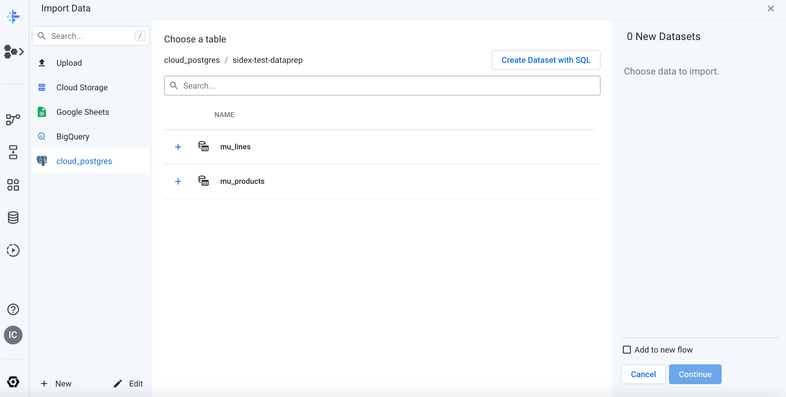

# Dataprep

# Tabla de contenido

1. [Overview](#overview)
2. [Features](#features)
3. [Demo](#demo)

## Overview

[(Volver al Inicio)](#tabla-de-contenido)

Dataprep de Trifacta es un servicio inteligente de datos que permite limpiar, preparar y explorar de manera visual datos estructurados y sin estructurar para el análisis, la elaboración de informes y el aprendizaje automático. 

## Features

[(Volver al Inicio)](#tabla-de-contenido)

### Predictive Data Transformation

Dataprep cuenta con una interfaz visual que permite hacer diversas transformaciones en los datasets tales como: actualizar tipos de datos, eliminar filas, columnas, crear campos calculados, hacer joins, etc. 

### Collaboration and Sharing

Dataprep ofrece la opcion de colaboracion en tiempo real de lo que se trabaja, dando los accesos necesarios (editor y lector)

### Basic Connectivity to Cloud Storage and Cloud Data Warehouses

Dataprep permite conectarse a cualquier sistema de almacenamiento en la nube

### Data Profiling

Dataprep ofrece graficos estadisticos que permiten visualizar las caracteristicas de los datos con los cuales estamos trabajando

## Demo

[(Volver al Inicio)](#tabla-de-contenido)

1. **Generar la conexion:** En este caso sera del tipo PostgreSQL hacia nuestro proyecto en GCP

2. **Importar las tablas:** Se importan las tablas que se necesitaran de la conexion

4. **Crear el flow:** Se crea el flow, para luego definir los inputs, receta y output

5. **Definir los inputs:** Se seleccionan de las tablas importadas cuales se van a usar

6. **Definir la receta:** Se define la receta (data quality) que se aplicaran a los inputs

7. **Definir el output:** Se selecciona el output con los parametros sobre los cuales se ejecutara el proceso
